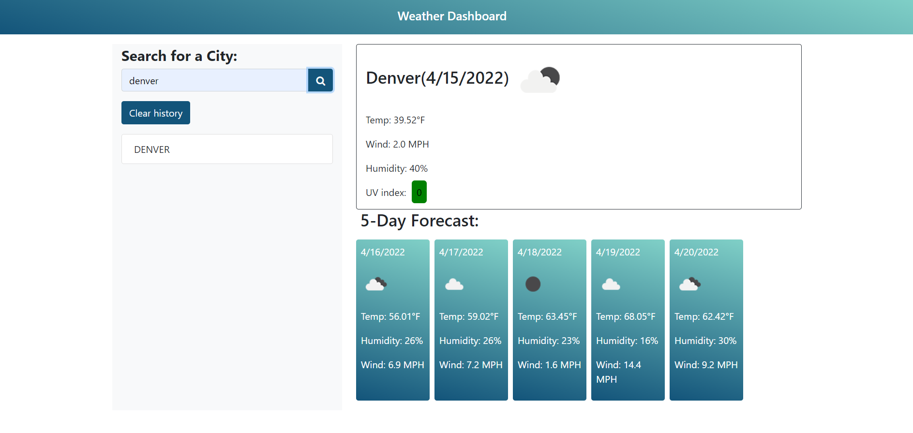

# 06 Server-Side APIs: Weather Dashboard

## Project Description

Build a weather dashboard that will run in the browser and feature dynamically updated HTML and CSS from scratch. It needs to resemble the image given.

## What is Used
    * Bootstrap
    * style.css
    * index.html
    * script.js
    * JQuery
    * Moment.js
    * OpenWeather One Call API
    * AJAX

## Main Objective

Use a third party API below to retrieve weather data for cities.
[OpenWeather One Call API](https://openweathermap.org/api/one-call-api) 

Use `localStorage` to store any persistent data. For assistance refer to
[Full-Stack Blog on how to use API keys](https://coding-boot-camp.github.io/full-stack/apis/how-to-use-api-keys).

## Items completed in Project

✅ Create a weather app with a form input to search for a specific city.

✅ When a specific city is searched it is then saved on the Local Storage and will be saved under the search history.

✅ When a specific city and a date is entered an icon, temperature, humidity, wind speed and UV index will be displayed.

✅ When the UV index is viewed a color will indicate whether the conditions are favorable, moderate, or severe.

✅ When future weather conditions are viewed for that city a 5-day forcast will display the date, an icon representation of conditions, temperature, wind speed, and the humidity.

✅ When a city in the search history is clicked, then current and future conditions for that city are presented.

## Live URL
https://cynthiagodoy.github.io/Weather-Dashboard/

## Screenshot

- - -
© 2021 Trilogy Education Services, LLC, a 2U, Inc. brand. Confidential and Proprietary. All Rights Reserved.
